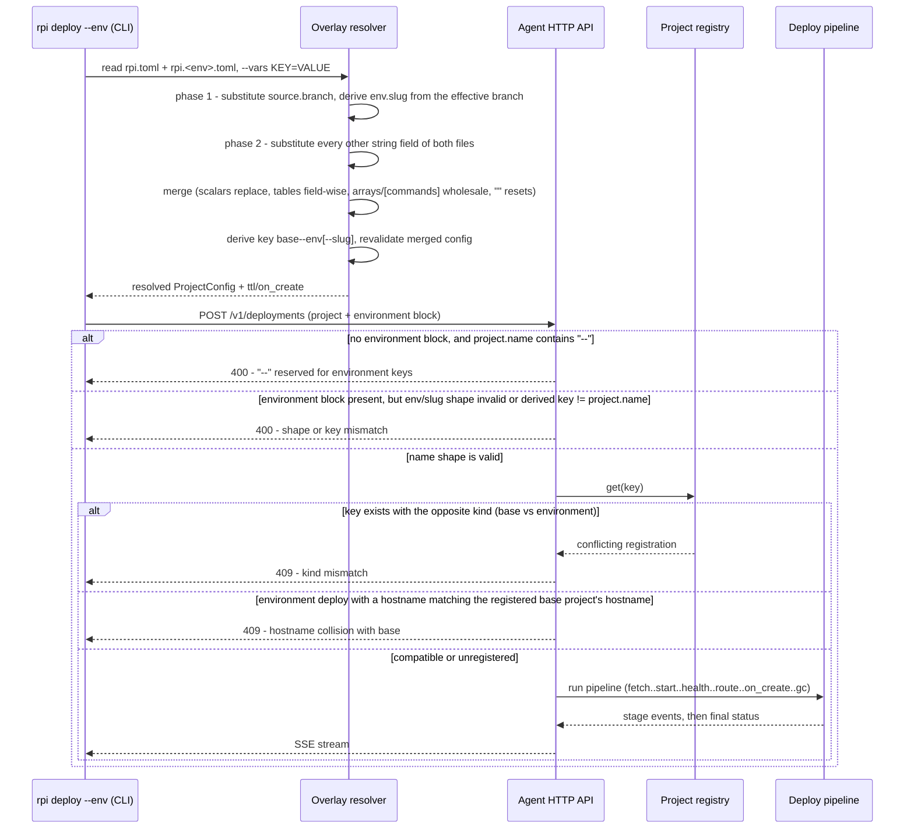
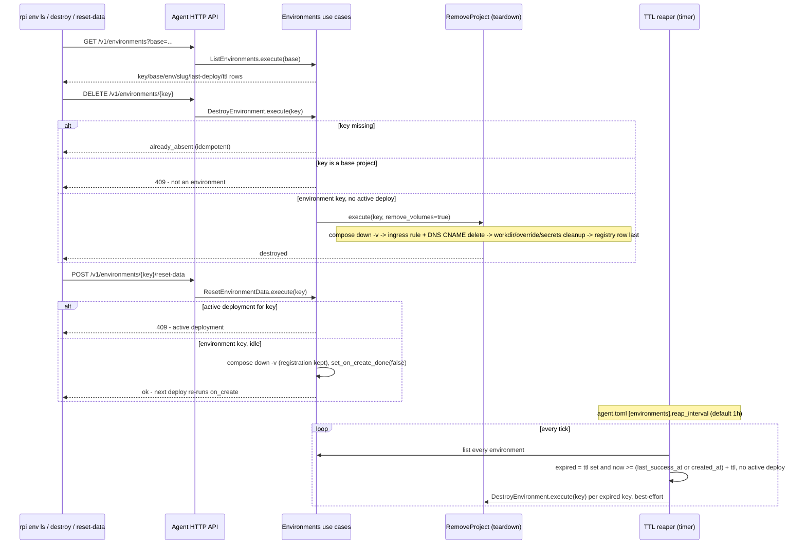

# Environment overlays

An environment overlay lets one project deploy to more than just its single
production key: a shared `test` environment, or an ephemeral per-branch
preview, built from the same repository and mostly the same `rpi.toml`. This
document covers the whole path: how the CLI computes an environment's merged
configuration and derived key from an overlay file, how the agent tells an
environment deploy apart from a plain one, the one extra one-time stage the
deploy pipeline runs for environments, how a deployed environment is listed,
destroyed, or reset, and how an environment with a TTL is torn down on its
own once it expires. See `flows/deploy.md` for the deploy pipeline both kinds
of project share, and `flows/ingress.md` for the Cloudflare route/DNS
teardown an environment destroy also goes through.

## Walkthrough

1. `rpi deploy --env <env> [--vars KEY=VALUE ...]` — and, identically,
   `rpi command`, every `rpi secrets` subcommand, and
   `rpi config show`, all of which accept the same `--env`/`--vars` pair —
   resolves `./rpi.toml` plus `./rpi.<env>.toml` entirely locally, before the
   agent is ever contacted. `--vars` does not require `--env`: a base
   `rpi.toml` may carry variables of its own, and `rpi deploy --vars ...` or
   `rpi config show --vars ...` resolves it with no overlay in sight.
   - *Failure*: no `rpi.<env>.toml` next to `rpi.toml` fails with an error
     that lists whichever `rpi.*.toml` files it did find in the directory.
     `<env>` itself must match `^[a-z][a-z0-9-]*$` and must not be one of the
     names reserved for `rpi env`/`rpi config` subcommands (`show`, `ls`,
     `destroy`, `reset-data`).
2. **Variables.** Substitution reaches *every* string field of both files —
   or of `rpi.toml` alone when no overlay was selected — including
   `[commands]` in string form, in argv-array form, and the command table's
   `service` field. It knows three disjoint namespaces, told apart by syntax
   alone:
   - `${NAME}`, matching `^[A-Z][A-Z0-9_]*$`, is a **user variable** supplied
     by `--vars NAME=VALUE` (repeatable, everything after the first `=` is
     the value). The name is arbitrary — `BRANCH_NAME` has no special status
     any more — except that the `RPI_` prefix is refused.
   - `${ns.field}` is a **resolver input**: a fact about the machine running
     rpi or about the resolution itself. The namespaces are exactly `git` and
     `env`, and the inputs are exactly `git.branch`, `git.sha`,
     `git.short_sha`, `env.name` and `env.slug`. An unknown namespace or an
     unknown field is an error listing the ones that do exist; a body that is
     neither shape (`${}`, `${a.b.c}`, `${Mixed.case}`, an unclosed `${`) is
     an error explaining the two forms. Every one of them names the
     configuration field it was written in, so the message points at a line
     rather than at "somewhere in your config".
   - `RPI_*` names are **runtime variables**, which exist only inside
     containers and exec'd processes and never in a TOML file (see
     `flows/deploy.md`). A `${RPI_...}` reference here is therefore its own
     error stating that rule rather than a generic "unknown variable", and
     `${RPI_ENV_SLUG}` specifically also suggests `${env.slug}` — that
     rename is the one hard break in this system.
   The `${git.*}` inputs shell out to `git` **lazily**, only for the ones a
   configuration actually references, so a project that uses none still
   resolves outside a git repository. A detached `HEAD` fails `${git.branch}`
   outright — with a message naming `--vars` as the workaround — rather than
   yielding the literal `HEAD`, which would quietly key every CI run of a
   branch preview to the same environment; `${git.sha}` and `${git.short_sha}`
   still read fine while detached.
   - `$${` renders a literal `${` and is inert as a reference, which is how a
     command keeps a shell variable of its own (`sh -c 'tar -C $${HOME} .'`).
     `$$` is special only immediately before `{`: a lone `$`, `$$`, or `$5`
     is ordinary text.
   - `[project].name` refuses any reference with a dedicated error: the
     project key drives `base--env[--slug]` derivation and the
     hostname-hijack check below, neither of which is verifiable against a
     computed name. `schema` cannot carry one either — in the base file it is
     a number, so a `${...}` string fails the type check, and in an overlay
     the key is forbidden outright.
   - `[secrets].groups` refuses one too, in either file, for the same class
     of reason: a group name is attachment identity — it has to match a group
     that already exists on the agent under the base project — so a computed
     name would silently attach the wrong group, or none, far from the typo
     that caused it. Every other `[secrets]` field (`env`, `files`,
     `file_mode`) substitutes normally.
   - A `--vars` key that no string in either file references is an error
     naming that key (a typo'd variable is otherwise silent). The mirror
     case, a reference with no value, is the "unknown variable" error above.
   - Substitution runs over the raw TOML trees, before either file is
     deserialized, in two phases: **phase 1** resolves `source.branch` alone,
     because `env.slug` is derived from the resulting effective branch
     (the overlay's if it sets one, otherwise the base's, otherwise `main`);
     **phase 2** resolves everything else. `${env.slug}` inside
     `source.branch` is therefore rejected as a circular reference. Because
     substitution precedes deserialization, every substituted value goes
     through the ordinary typed validation afterwards — which is what catches
     a raw branch name interpolated into a hostname (see step 4).
   - `env.slug` itself is the branch name lower-cased, with every run of
     characters outside `[a-z0-9]` collapsed to one `-`, truncated to 30
     characters and stripped of a trailing `-`; a branch that normalizes to
     nothing is an error. `env.name` is the `<env>` argument. Both exist only
     when an environment was selected — referencing either without `--env` is
     an "unknown variable" error.
3. The overlay merges onto the base configuration field by field: scalars
   replace, nested tables merge field-wise (only the fields actually present
   in the overlay change), `[commands]` and array fields (`secrets.files`,
   `secrets.groups`) replace wholesale rather than merge — an overlay that
   declares `secrets.groups = []` explicitly detaches every group rather
   than inheriting the base file's — and an explicit empty string (`""`)
   resets an optional field to unset instead of being treated as a normal
   value.
4. The merged configuration's `project.name` is overwritten with the derived
   key, and the result is revalidated: `<base>--<env>` for a static overlay, or
   `<base>--<env>--<slug>` when either file references `${env.slug}`. The
   slug suffix hangs on that one reference and nothing else — merely *using*
   a variable no longer earns a per-branch key, which is what kept a shared
   stand (`.env.${STAGE}` and a fixed hostname, say) from silently turning
   into a per-branch environment that demanded a branch name. Because the
   difference is invisible in the output otherwise, an environment resolved
   with `--vars` but no `${env.slug}` anywhere prints a warning naming the
   key it is actually getting (`<base>--<env>`, no suffix). The overlay's own
   `[environment]` section (`ttl`, `on_create`) is pulled out separately
   rather than merged into the deployed config; if `on_create` is set, it
   must name a command that survives in the merged `[commands]` table (which
   the overlay may itself have replaced wholesale), or resolution fails right
   here, before any agent contact.
   - *Failure*: `validate_common` also rejects a merged `[ingress]
     .hostname` that isn't a well-formed DNS name (RFC-1123-style: label
     length, charset, no leading/trailing `-`) — this catches a raw branch
     name substituted straight into the hostname (a `/` in a branch name like
     `feature/login` is invalid DNS), which is why `${env.slug}`, already
     sanitized, is the input meant for that field. Separately, if the merged
     hostname is present and equals the *base* file's hostname — whether
     inherited from an overlay with no `[ingress]` at all, or set explicitly
     to the same string — resolution fails right here: an environment must
     override the hostname to something else or clear it with
     `hostname = ""`. Without this check, the environment's first successful
     deploy would re-route the production hostname to the environment's own
     host port.
5. `rpi config show [--env <env>] [--vars ...]` runs this exact resolution
   and prints the merged TOML — plus a synthetic `[environment]` block when
   one was selected — without contacting the agent at all; it's the way to
   check what a deploy would actually send. After that it prints a
   `[runtime]` block previewing the `RPI_*` variables this configuration
   would export into its containers (`flows/deploy.md`), as far as they are
   knowable without an agent: `RPI_HOST_PORT` and `RPI_COMMIT_SHA` are shown
   as `<assigned by agent>` rather than omitted, because an operator chasing
   a variable that came out empty needs to see that it exists at all. The
   block is a preview, not input — nothing reads it back.
6. `rpi deploy --env <env>` sends the resolved `ProjectConfig` (its
   `project.name` already the derived key) alongside an `environment` block
   (`env`, `base`, `slug`, `ttl_secs`, `on_create`) in the same
   `POST /v1/deployments` request a plain deploy uses. Before sending it, the
   CLI checks the agent advertises the `environments` feature (agent
   `>= 0.24.0`) and refuses locally with an upgrade message if it's talking
   to an older agent.
7. **Secret groups follow the resolved config, not the environment.**
   `ProjectConfig.secret_groups` — the `[secrets].groups` list, itself
   subject to the overlay's wholesale-replace merge (item 3) — travels
   inside the same resolved `ProjectConfig` as everything else, so an
   overlay can declare its own group list independent of the base file's.
   At deploy time (`flows/secrets.md`) the agent resolves those groups
   against the *base* project's namespace (`environment.base`, not the
   derived key), which is the whole point of a group meant to be shared by
   more than one deploy. A fresh environment's first deploy therefore
   inherits every group its overlay declares immediately, with no separate
   `rpi secrets push` needed for those groups; only its own implicit key
   bundle starts empty, and the base project's own key bundle is never
   copied to it.
8. The agent validates shape before ever touching the registry. A request
   with **no** `environment` block whose `project.name` contains `--` is
   rejected 400 immediately — `--` is reserved for derived keys — which is
   why a plain, non-overlay deploy can never even reach the
   already-registered-as-an-environment check below. A request **with** an
   `environment` block is checked for name-part shape (`base`/`env`/`slug`
   charset, no `--`, no leading/trailing `-`) and that
   `base--env[--slug]` matches `project.name` exactly; either failure is also
   400, still before the registry is consulted.
9. Only once shape validation passes does the agent look the key up in the
   registry. If it already exists under the opposite kind — a plain deploy
   aimed at a key that's registered with environment metadata, or an
   environment deploy aimed at a key registered as a base project — the
   agent answers 409. Because step 8 already rejects every `--`-bearing name
   on a plain deploy, this 409 in practice only fires for a key that passes
   plain-deploy name validation (no `--`) yet is *already* registered as an
   environment — for example a registry row seeded by a version that
   predates this validation, not something a current CLI can produce on
   either side by accident. Right after that, for an environment deploy that
   carries a hostname, the agent looks up the registered *base* project (by
   `environment.base`, not the derived key) and answers 409 if its hostname
   matches — the same production-key protection as step 4's resolve-time
   check, but covering a stale or hand-crafted CLI that skips it.
10. From here the deploy pipeline (`flows/deploy.md`) runs unchanged through
   fetch, build, start, health, and the optional route stage. Right after
   that point — whether or not a hostname triggered an actual route — an
   environment deploy whose overlay set `on_create` and whose registry row
   still has `on_create_done = false` runs one extra stage: `on_create` execs
   that command inside its declared service (or the project's default
   service), exactly once per key.
   - *Failure*: a nonzero exit code, or an `on_create` name no longer
     present in the merged `[commands]` (a defensive re-check — the CLI
     already validated this at resolve time in step 4), fails the deploy at
     the `on_create` stage; `on_create_done` is left `false`, so the very
     next deploy of the same key retries it.
   - *Success*: `on_create_done` flips to `true` and the command never runs
     again for that key, across any number of future redeploys — only
     `rpi env reset-data` clears the flag back to `false`.
11. `gc` runs last, exactly as in a plain deploy.
12. The registry (`repo.rs`) persists `env_name`/`env_base`/`env_slug`/
    `env_ttl_secs`/`env_on_create`/`env_on_create_done` alongside the
    existing project row; `env_name IS NOT NULL` is what makes a row "an
    environment" for every guard and query in this document, and a
    redeploy's `UPDATE` never touches `env_on_create_done` — only
    `set_on_create_done` does. `mark_deploy_success` stamps
    `last_success_at` on every successful deploy, environment or not — the
    timestamp the reaper (step 15) reads — and, in the same statement,
    conditionally writes `last_commit_sha`: the column is coalesced with its
    own current value, so a call that carries no sha refreshes the timestamp
    without erasing the stored one. That stored sha is what `RPI_COMMIT_SHA`
    falls back to outside a deploy (`flows/deploy.md`).
13. `rpi env ls [--all] [--vars ...]` calls
    `GET /v1/environments[?base=<project>]`. Without `--all`, the CLI first
    resolves the current directory's own `rpi.toml` (no overlay, but with
    this command's own `--vars`, since variables reach the base file too) to
    get its `base` name and passes that as the filter; `--all`, or running
    outside any project directory, lists every environment on the agent
    instead. Only rows with `env_name` set are ever returned. `--vars` is
    deliberately *not* declared as conflicting with `--all`: a resolution
    failure here names both escape hatches (pass the variable, or use
    `--all`, which reads no configuration file), and appending `--all` to the
    command that just failed has to work rather than raise a second error.
14. `rpi env destroy <env> [--vars ...]` / `rpi env destroy --full-key
    <key>` and the same two forms for `rpi env reset-data` compute the
    target key one of two ways: the `<env>` form runs the exact same local
    overlay resolution `rpi deploy --env` uses — so a typo'd `--vars` fails
    the same way it would on deploy, and, when the configuration references
    `${env.slug}`, the slug part of the key is whatever the merged
    `source.branch` derives, and a resolution failure names both escape
    hatches (pass the variables, or use `--full-key`) so a directory that no
    longer resolves is not a dead end — while `--full-key <key>` reads no
    configuration file at all (not `rpi.toml`, not the overlay) and instead
    validates the string's own shape (`base--env` or `base--env--slug`, each
    part lowercase `[a-z0-9-]` with no leading/trailing `-`), rejecting
    anything else with a message pointing at `rpi env ls`. `--full-key` is
    mutually exclusive with both `<env>` and `--vars`, and exactly one of
    `<env>`/`--full-key` is required — this is the escape hatch for cleaning
    up an environment whose overlay was deleted or no longer resolves, since
    the `<env>` form has no such fallback. Either way, the CLI then prompts
    for the key to be typed back as confirmation unless `--yes` is passed.
    - `destroy` (`DELETE /v1/environments/{key}`) is idempotent: a missing
      key reports "already absent" rather than 404. A base-project key is
      409. Otherwise it delegates to the same `RemoveProject` teardown a
      plain `rpi rm` uses, with volume removal forced on: stop the stack
      (`compose down -v`) → drop the one matching Cloudflare ingress rule
      and delete its DNS CNAME (`flows/ingress.md`) → clean up the workdir,
      override file, and secrets bundle → remove the deployment-history rows
      → remove the registry row last. A failure partway through this chain
      leaves the registry row in place, so the reaper or a repeated
      `env destroy` can finish the remainder later instead of orphaning
      state with no registry trace at all.
      **The "secrets bundle" removed here is only this environment's own key
      bundle — never the groups its base project declared.** `RemoveProject`
      drops a base's declared groups too (`SecretStore::remove_base`), but
      only when it is tearing down the base itself
      (`config.environment.is_none()`); an environment key always fails that
      check, so `env destroy` can never take the shared groups a sibling
      environment still attaches (`flows/secrets.md` item 12 has the full
      rule).
    - `reset-data` (`POST /v1/environments/{key}/reset-data`) is narrower:
      it only tears down the stack's containers and named volumes
      (`compose down -v`) and clears `on_create_done` back to `false` — the
      registry row, secrets, and ingress route all survive — so the very
      next deploy of that environment re-runs `on_create` against a clean
      database. A missing key is a genuine 404 here (there's nothing to
      reset); a base-project key, or a key with an active deployment, is
      409.
15. A background sweep (`agent/run.rs`, on a timer whose period comes from
    `agent.toml`'s `[environments].reap_interval`, default one hour) calls
    `ReapEnvironments::execute` once per tick. It lists every environment
    and, for each one with a `ttl` set, computes an expiry anchor from that
    listing snapshot — the last successful deploy time, or the row's
    creation time if it never deployed successfully — as a first, cheap
    filter for "possibly expired, not active". An environment with no `ttl`
    is never touched by the reaper, regardless of age; one with an active
    deployment is skipped for this tick and retried on the next one. Each
    environment it does destroy goes through the exact same
    `DestroyEnvironment`/`RemoveProject` path as an operator-initiated
    `env destroy` (step 14), so the same group non-removal guarantee applies
    unattended: a TTL expiry never drops the base project's declared groups,
    only ever the expiring environment's own key bundle.
    - *TOCTOU guard*: right before actually destroying a candidate that
      passed both of those checks, the reaper re-fetches that one row fresh
      and recomputes the same expiry test against it. A redeploy that
      completed successfully *during* the sweep — after the listing snapshot
      was taken but before the destroy call — refreshes `last_success_at`
      without ever showing up as "active" at the instant the active-deploy
      check ran; without this re-check the reaper would destroy an
      environment that was just redeployed. If the fresh row is no longer
      expired (or has vanished, or lost its environment metadata), the
      candidate is skipped for this tick instead of destroyed.
    - A destroy failure for one environment is logged and retried next tick
      without aborting the sweep for the others — only a failure to *list*
      environments in the first place aborts the whole sweep, since there
      would be nothing left to iterate.

## Source anchors

- `crates/bin/src/cli/vars.rs` — the variable engine itself, independent of
  any file format: `parse_vars` (the `--vars` charset and the `RPI_` refusal),
  `classify` (which of the three namespaces a reference body belongs to, and
  the `${RPI_ENV_SLUG}` → `${env.slug}` hint), the tokenizer that treats
  `$${` as a literal `${`, `refs` (every reference in a string, reported
  without needing any values — which is what lets the resolver decide
  up front which lazy inputs to compute), and `substitute`.
- `crates/bin/src/cli/gitctx.rs` — the `${git.*}` inputs (`branch`, `sha`,
  `short_sha`), each shelling out to `git` in an explicit directory; the
  detached-`HEAD` error that names `--vars` as the workaround lives here.
- `crates/bin/src/cli/overlay.rs` — the resolver: overlay parsing
  (`RpiTomlOverlay`, `deny_unknown_fields`), the `walk_strings` sweep that
  reaches every string leaf of both raw documents, the two-phase substitution
  in `resolve_with` (`source.branch` first, then everything else) with its
  `[project].name` ban, unreferenced-`--vars` check, lazy `git_inputs`,
  `env.slug` derivation (`derive_slug`) and circular-reference guard, the
  no-slug key warning (fired when the `source.branch` that *wins* the merge
  carries any `${...}` reference while nothing references `${env.slug}` —
  "the branch is variable but the key is not", which is what makes two
  branches collide on one key; *not* keyed on `--vars`, which would both miss
  a `${git.*}` branch and nag about a deliberately shared stand), the merge
  (`apply_overlay`), key derivation
  (`derive_key`), the base-hostname-hijack check (merged hostname vs. the
  base file's, captured before the merge), and the
  `resolve`/`resolve_from`/`render_resolved` entry points that
  `rpi deploy`, `rpi config show`, `rpi command`, and
  `rpi secrets push/send/ls/diff` and `rpi secrets group ls/rm` all call.
- `crates/bin/src/cli/rpitoml.rs` — `from_value`/`validate_common`, the typed
  validation every substituted document is re-run through, including
  `validate_hostname` (RFC-1123-style: length, labels, charset) on both the
  base file and the merged overlay result, so a raw branch name substituted
  into `[ingress].hostname` is caught post-substitution.
- `crates/domain/src/runtimevars.rs` — `rpi_vars`, the single definition of
  the `RPI_*` set. Relevant here because it is the namespace a TOML file may
  not name, because an environment deploy is what adds `RPI_ENV` and
  `RPI_ENV_SLUG` to it, and because `rpi config show`'s `[runtime]` block
  previews it; how it reaches a container is `flows/deploy.md`.
- `crates/bin/src/cli/envcmds.rs` — `rpi env ls/destroy/reset-data`.
  `destroy`/`reset-data`'s `target_key` picks the key one of two ways: given
  `<env>`, it calls the same `overlay::resolve` `rpi deploy --env` uses (so
  it needs `rpi.<env>.toml` to still exist and resolve, exactly like a
  deploy); given `--full-key <key>` instead, it reads no configuration file
  at all and validates the key's own `base--env[--slug]` shape
  (`is_valid_key_part` per segment) — the escape hatch for a project whose
  overlay was deleted or no longer resolves. `<env>` and `--full-key` are
  mutually exclusive and one is required. `env ls`'s `base_filter` — a pure
  function of `(--all, the base file's text, --vars)`, with the read left in
  `env_ls` so it stays unit-testable — distinguishes "no `rpi.toml` here"
  (its friendly `--all` hint) from any other resolution failure, which keeps
  its own message and only gains the `--vars`/`--all` hints on top.
- `crates/bin/src/agent/http.rs` — `create_deployment`'s pre-registry shape
  guards (`is_valid_name`, `is_valid_env_part`, the `--`-rejection for plain
  deploys, the base/env/slug/key-match checks for environment deploys), the
  post-lookup kind-mismatch 409, and — once `config.environment` is set —
  the base-project hostname-collision 409 (looks up `environment.base` in
  the registry and compares hostnames); the `/v1/environments` routes
  (`list_environments_handler`, `destroy_environment_handler`,
  `reset_environment_handler`).
- `crates/bin/src/cli/commands.rs` — the CLI side of everything that
  resolves a configuration: `deploy` calls `overlay::resolve`, gates on the
  `environments` compat feature once an environment was selected, and builds
  the `environment` DTO in the deploy request; `secrets_send`, `secrets_ls`
  and `command` each gate `Feature::Environments` in addition to their own
  feature (`Secrets`/`Commands`) on the same condition; `config_show` prints
  the resolved TOML followed by `render_runtime_preview`'s `[runtime]` block
  (values serialized through `toml::Value`, so a `--vars` value carrying
  quotes still yields parseable output); and `collect_secrets` refuses a
  secret key with the `RPI_` prefix, so nothing can compete with the
  agent-injected namespace inside a container.
- `crates/application/src/environments.rs` — the four environment use
  cases: `ListEnvironments`, `DestroyEnvironment` (idempotent delete,
  base-key guard, delegates teardown to `RemoveProject`),
  `ResetEnvironmentData` (its own active-deploy guard, `compose down -v`
  plus `set_on_create_done(false)`), and `ReapEnvironments` (the TTL sweep,
  including its pre-destroy fresh re-check of each candidate).
- `crates/application/src/remove.rs` — `RemoveProject`, the single teardown
  `rpi rm`, `env destroy`, and the TTL reaper all delegate to; only calls
  `SecretStore::remove_base` when `existing.config.environment.is_none()`,
  which is why an environment's teardown (steps 14–15) never removes its
  base's declared groups — full rule in `flows/secrets.md` item 12.
- `crates/application/src/deploy.rs` — `run_stages`'s `on_create` block:
  runs once after health (and the optional route stage) when `on_create` is
  set and not yet done, fails the deploy on a nonzero exit or an undeclared
  command name, and flips `on_create_done` only on success.
- `crates/application/src/lib.rs` (`effective_secrets`) — resolves
  `ProjectConfig.secret_groups` against `environment.base` (not the derived
  key) for an environment deploy, so a base project's declared groups are
  shared by every environment built from it; full mechanics in
  `flows/secrets.md`.
- `crates/infrastructure/src/repo.rs` — the registry's `env_name`/
  `env_base`/`env_slug`/`env_ttl_secs`/`env_on_create`/`env_on_create_done`
  columns plus `last_success_at`/`last_commit_sha`; `list_environments`
  (filters on `env_name IS NOT NULL`, optionally by `env_base`);
  `mark_deploy_success` (one `UPDATE` writing the timestamp and coalescing
  the sha); `set_on_create_done`; and `upsert`, whose `UPDATE` never touches
  `env_on_create_done`.
- `crates/bin/src/agent/run.rs` — spawns the TTL reaper's timer loop at
  agent startup, reading its interval from `agent.toml`.
- `crates/bin/src/agent/config.rs` — `[environments].reap_interval`
  parsing (`reap_interval_secs`, default one hour).
- `crates/bin/src/compat.rs` — the `environments` feature gate
  (`Feature::Environments`, since `0.24.0`) that `rpi deploy --env` and
  `rpi env *` check before talking to an older agent.
- `crates/bin/src/main.rs` — the clap surface: `--env`/`--vars` on `deploy`,
  `command`, every `secrets` subcommand and `config show`, and `env destroy`/
  `reset-data`'s `--full-key`, declared with `conflicts_with_all = ["env",
  "vars"]`. The flag is `--full-key` rather than `--key` because the
  flattened `ConnectOpts` already owns `--key` for the SSH private key path.
