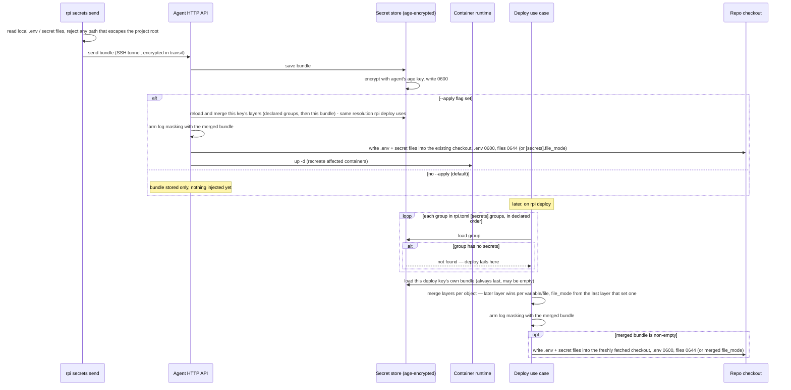

# Secrets lifecycle

This document explains what happens to a project's secrets — its `.env`
variables and any other secret files — from the moment they leave the
developer's machine to the moment they land inside a running container on
the Pi. It covers how they are protected while traveling to the agent, how
they are protected while sitting on disk, the two different moments they can
be written into a checkout, and how their values are kept out of logs.

## Walkthrough

1. **What can be a secret.** `rpi secrets send` reads the project's `.env`
   file (the default, or whichever file `[secrets].env` names) plus every
   file listed under `[secrets].files` — arbitrary files such as TLS
   certificates, not just key/value variables. Every one of those paths is
   validated before anything leaves the machine: it must be a plain relative
   path with no `..`, no leading slash, no backslashes or drive letters, and
   it must not resolve (following any symlink) outside the project root. A
   path that fails this check is rejected on the client; nothing is sent.

2. **Protected in transit.** The bundle travels to the agent over the same
   SSH tunnel used for every CLI-to-agent request, so it is never sent in
   the clear over the network.

3. **Protected at rest.** As soon as the agent receives the bundle, the
   secret store encrypts it whole — variable values and file contents alike
   — with age, using a keypair the agent generated for itself the first time
   it ran and keeps on disk at file mode 0600. The encrypted bundle is
   written one file per project: the secret store's own copy of a bundle is
   never written to disk unencrypted. (A bundle's values do reach disk as
   plaintext elsewhere — deliberately, when injected into a checkout; see
   item 4.) `/var/lib/rpi` itself — the tree everything above lives under —
   is created and repaired at mode 0750, owned by the agent; that directory
   mode, not any individual file's mode, is what keeps other local users off
   the whole tree.

4. **Two moments secrets get injected.** Plaintext secret values are
   written into a checkout only during one of these two operations, never
   in between:
   - **Immediately, with `--apply`.** Right after saving, if the caller
     passed `--apply`, the agent resolves this deploy key's full layer
     stack — every group named in `rpi.toml`'s `[secrets].groups`, in
     declared order, then the bundle just saved on top — the identical
     resolution `rpi deploy` uses (item 5), decrypting it fresh from the
     store rather than reusing the upload in memory. It then writes the
     merged `.env` and secret files straight into the project's existing
     checkout and recreates the affected containers. A separate
     `POST .../secrets/apply` route re-runs exactly this resolve-and-inject
     step without a new upload, for a caller that only wants to re-apply
     what is already stored.
   - **Later, on `rpi deploy`.** Every deploy resolves the project's full set
     of layers — every group named in `rpi.toml`'s `[secrets].groups`, in the
     order declared, then this deploy key's own bundle on top — and writes
     the merged result into the freshly fetched checkout before the stack
     starts. This is the only place a previously-stored bundle's values are
     decrypted and written back out onto disk as plaintext, other than the
     `--apply`/`secrets/apply` paths above, which resolve the same way. See
     item 5 for how the layers combine.

   Both moments write the same two artifacts with different default modes,
   because they have different readers. `.env` lands at **0600**: Compose
   reads it as the agent itself, so nothing needs it wider. Every file from
   `[secrets].files` lands at **0644**: it is typically bind-mounted as a
   Compose `file:`-sourced secret into a container running under its
   image's own, unrelated uid, and Docker silently ignores a `file:`
   secret's `mode`/`uid`/`gid` outside Swarm — the host file's own mode is
   the only thing that decides whether that container can read it.
   Directories the writer creates along the way (and a directory it created
   before this change, at exactly 0700, that it still owns) are always
   **0755**, independent of everything else: a directory mode protects
   nothing here, the file mode does. A project can override both `.env` and
   the secret files' mode at once with `[secrets].file_mode` in `rpi.toml`
   (see the `rpi-toml` skill and README); `.rpi-secrets-manifest.json`, the
   writer's own bookkeeping, stays 0600 unconditionally regardless of
   `file_mode`. The mode travels with the bundle, so changing `file_mode`
   takes effect the next time a bundle carrying it is actually written —
   `rpi secrets send --apply`, or a `rpi deploy` that loads a bundle sent
   after the change — not by itself.

   `rpi secrets ls` also decrypts a previously-stored bundle, but only in
   memory and only to read the secret and file names (and configured mode)
   it contains — the values themselves are discarded and never written to
   disk or shown. Re-sending a bundle later fully replaces the previous one:
   any variable or file left out of the new bundle is removed from a
   checkout the next time secrets are injected.

5. **Layering.** `rpi deploy`, `--apply`, and `POST .../secrets/apply` all
   load each group named in `[secrets].groups`, in the declared order, then
   the deploy key's own bundle — always last, so a value scoped to one key
   always wins over a shared group. The layers are merged per object, not
   per group: a later layer replaces an earlier one entry by entry, by
   variable name for variables and by file path for files, so an untouched
   variable from an earlier layer survives even when a later layer redefines
   a different one. `[secrets].file_mode` resolves the same way — from the
   last layer in the list that actually set one, so a later layer that
   leaves it unset does not erase an earlier layer's choice. Masking is
   armed on the *merged* bundle, so a value contributed by any layer — group
   or key — is masked in the operation's output, not only one that came from
   the key's own bundle. The "secrets injected" log line names every layer
   that contributed and the revision it was loaded at, in order, ending with
   the key's own (for example `groups: common@r3, preview@r1, key@r5`), so
   provenance is visible without ever printing a value.
   - *Failure*: a group named in `[secrets].groups` that doesn't exist, or
     exists with no secrets in it, fails the operation right here — nothing
     has been written to the checkout yet — rather than starting (or
     restarting) the application without configuration it depends on. This
     applies to `rpi deploy` and to both apply paths above alike, and is
     different from the deploy key's own bundle, which is allowed to be empty (see
     item 8): a *declared* group is a promise the project made about what it
     needs, and an empty one breaks that promise silently if it's allowed
     through.

6. **Masking secret values in logs.** From the moment either injection above
   arms it, every line the agent would otherwise log during that operation
   has each secret variable's value (6 characters or longer) replaced with
   `***KEY***`, longest values checked first so one secret's value can never
   hide inside another's. Shorter values (ports, booleans) are left alone on
   purpose, to avoid masking ordinary output that happens to match a short
   value. Secret file contents are not scanned for masking.

7. **Failure: sending to a project that doesn't exist.**
   `rpi secrets send --apply` for a project the agent has never deployed
   fails — the response reports the project isn't deployed yet and to run
   `rpi deploy` first. The bundle is still saved, encrypted, before this
   check runs, so a subsequent `rpi deploy` picks it up normally. Sending
   without `--apply` does not check whether the project is deployed at all:
   only the project name itself is validated, so secrets for a name that
   hasn't been deployed yet are simply stored, waiting for the first
   deploy.

8. **Failure (silent): deploy without secrets sent.** If nothing was ever
   sent for a project's deploy key and no groups are declared for it, the
   store has nothing to return for it. `rpi deploy` proceeds without writing
   a `.env` file or any secret files — this is not reported as an error; the
   service just starts without them, and it is up to the service to cope
   with the missing configuration. A *declared* group behaves differently —
   see item 5.

9. **Failure: path traversal rejected.** Every secret file's relative path
   is validated twice against the same rule — once by the CLI before
   sending, and again by the agent at the moment it writes to disk — so a
   path that escapes the project root is caught however it got there.
   Writing also refuses to create, or write through, a symlink at any
   intermediate directory level, so a symlink committed into the repository
   itself cannot redirect a write outside the checkout. Either check failing
   aborts that write instead of touching the filesystem outside the
   checkout.

10. **Group management routes (agent-side; no CLI command yet).** The agent
    also serves `PUT`/`GET`/`DELETE /v1/projects/{base}/secret-groups/{group}`
    and `GET /v1/projects/{base}/secret-groups` — push, inspect, delete, and
    list the named groups of one base project. Push accepts `merge: true` to
    upsert onto the stored group instead of replacing it wholesale, and an
    `expected_revision` for the same compare-and-swap guard `rpi secrets
    send` uses; delete refuses a group any registered project still declares
    unless `force: true` is set. Every response carries names, sizes,
    digests and revisions only, never a value — the same rule item 4's
    `rpi secrets ls` follows. No released `rpi` command calls these routes
    yet; they exist so a forthcoming `rpi secrets group ls`/`rm` (and
    `--group`/`--merge` on `push`) has somewhere to call.

## Source anchors

- `crates/application/src/secrets.rs` — `SendSecrets`/`ListSecrets` (save/list a deploy key's own bundle), `HeadKeySecrets` (metadata-only projection of that bundle, never a value), and `ApplySecrets` (resolves the key's full layer stack via `effective_secrets` and re-injects + `up -d` — the one implementation `--apply` and `POST .../secrets/apply` both call).
- `crates/application/src/secretgroups.rs` — group CRUD use cases (`PushSecretGroup`, `ShowSecretGroup`, `ListSecretGroups`, `RemoveSecretGroup`): the only place that joins the vault (`SecretStore`) with the project registry, e.g. to report which projects declare a group or to refuse deleting one still declared.
- `crates/bin/src/agent/http.rs` (secrets + secret-group routes) — validates and decodes an incoming bundle once (`decode_secret_payload`, shared by the per-key and group write paths), validates a group name with the same rule the `rpi.toml` parser uses (`pi_domain::secretgroup::validate_group_name`), and serves both route families; no handler ever serializes a secret value.
- `crates/bin/src/proto.rs` (secrets + secret-group DTOs) — wire shapes for both route families; group and head responses carry names, digests, sizes and revisions only.
- `crates/bin/src/cli/rpitoml.rs` (`SecretsSection` only) — the `[secrets]` table in `rpi.toml`: names the local env file `rpi secrets send` reads (`[secrets].env`, default `.env`), the extra files it reads verbatim (`[secrets].files`), the declared group list (`[secrets].groups`, carried into `ProjectConfig.secret_groups` in declared order by `to_project_config`), and the optional `[secrets].file_mode` override, parsed and validated by `pi_domain::secretmode`.
- `crates/application/src/mask.rs` — `MaskingSink`: replaces armed secret values (6+ characters) with `***KEY***` in every line logged afterward.
- `crates/infrastructure/src/secrets.rs` — `EncryptedFileStore`: age-encrypts and decrypts the bundle at rest, one file per project or named group, using an agent identity key kept at file mode 0600.
- `crates/infrastructure/src/secretsfile.rs` — `FsSecretsWriter`: writes `.env` (0600 by default) and secret files (0644 by default; both overridable by `bundle.file_mode`/`[secrets].file_mode`) into a checkout, creates directories at 0755 and widens a directory it created earlier at exactly 0700, replaces the previous bundle's files via a small manifest (always 0600), and guards every write and cleanup against symlink escapes.
- `crates/infrastructure/src/secretpath.rs` — shared relative-path validation and symlink-safe path resolution, used by both the CLI (before sending) and the agent (before writing).
- `crates/infrastructure/src/dotenv.rs` — `.env` parsing and serialization shared by the CLI (reading the local file to send) and the agent (writing the injected file).
- `crates/domain/src/secretgroup.rs` — `GroupRef` (named group vs. the deploy key's implicit one), `SecretGroup`, `Layer`, and `merge_layers`: the pure per-object merge (later layer wins by variable name/file path, `file_mode` from the last layer that set one) the deploy pipeline builds its layer resolution on.
- `crates/application/src/lib.rs` (`effective_secrets`, `MAX_MERGED_SECRET_BYTES`) — resolves one project's full layer stack (every declared group in order, then the key bundle) against the `SecretStore` and merges it. Deliberately factored out of `deploy.rs` so any future caller that needs the same view resolves it identically, rather than each one re-implementing the layering rules.
- `crates/application/src/deploy.rs` — the deploy pipeline's secret-injection point: calls `effective_secrets`, arms masking on the merged bundle, writes it into the freshly fetched checkout before the stack starts, and logs the contributing layers and their revisions.
