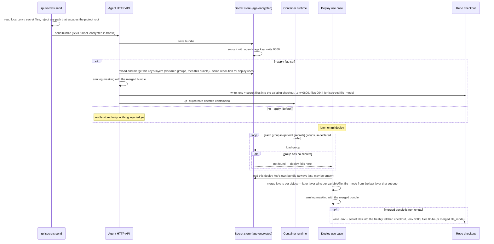

# Secrets lifecycle

This document explains what happens to a project's secrets — its `.env`
variables and any other secret files — from the moment they leave the
developer's machine to the moment they land inside a running container on
the Pi. It covers how they are protected while traveling to the agent, how
they are protected while sitting on disk, the two different moments they can
be written into a checkout, and how their values are kept out of logs.

## Walkthrough

1. **What can be a secret.** `rpi secrets send` reads the project's `.env`
   file (the default, or whichever file `[secrets].env` names) plus every
   file listed under `[secrets].files` — arbitrary files such as TLS
   certificates, not just key/value variables. Every one of those paths is
   validated before anything leaves the machine: it must be a plain relative
   path with no `..`, no leading slash, no backslashes or drive letters, and
   it must not resolve (following any symlink) outside the project root. A
   path that fails this check is rejected on the client; nothing is sent.

2. **Protected in transit.** The bundle travels to the agent over the same
   SSH tunnel used for every CLI-to-agent request, so it is never sent in
   the clear over the network.

3. **Protected at rest.** As soon as the agent receives the bundle, the
   secret store encrypts it whole — variable values and file contents alike
   — with age, using a keypair the agent generated for itself the first time
   it ran and keeps on disk at file mode 0600. The encrypted bundle is
   written one file per project: the secret store's own copy of a bundle is
   never written to disk unencrypted. (A bundle's values do reach disk as
   plaintext elsewhere — deliberately, when injected into a checkout; see
   item 4.) `/var/lib/rpi` itself — the tree everything above lives under —
   is created and repaired at mode 0750, owned by the agent; that directory
   mode, not any individual file's mode, is what keeps other local users off
   the whole tree.

4. **Two moments secrets get injected.** Plaintext secret values are
   written into a checkout only during one of these two operations, never
   in between:
   - **Immediately, with `--apply`.** Right after saving, if the caller
     passed `--apply`, the agent resolves this deploy key's full layer
     stack — every group named in `rpi.toml`'s `[secrets].groups`, in
     declared order, then the bundle just saved on top — the identical
     resolution `rpi deploy` uses (item 5), decrypting it fresh from the
     store rather than reusing the upload in memory. It then writes the
     merged `.env` and secret files straight into the project's existing
     checkout and recreates the affected containers. A separate
     `POST .../secrets/apply` route re-runs exactly this resolve-and-inject
     step without a new upload, for a caller that only wants to re-apply
     what is already stored.
   - **Later, on `rpi deploy`.** Every deploy resolves the project's full set
     of layers — every group named in `rpi.toml`'s `[secrets].groups`, in the
     order declared, then this deploy key's own bundle on top — and writes
     the merged result into the freshly fetched checkout before the stack
     starts. This is the only place a previously-stored bundle's values are
     decrypted and written back out onto disk as plaintext, other than the
     `--apply`/`secrets/apply` paths above, which resolve the same way. See
     item 5 for how the layers combine.

   Both moments write the same two artifacts with different default modes,
   because they have different readers. `.env` lands at **0600**: Compose
   reads it as the agent itself, so nothing needs it wider. Every file from
   `[secrets].files` lands at **0644**: it is typically bind-mounted as a
   Compose `file:`-sourced secret into a container running under its
   image's own, unrelated uid, and Docker silently ignores a `file:`
   secret's `mode`/`uid`/`gid` outside Swarm — the host file's own mode is
   the only thing that decides whether that container can read it.
   Directories the writer creates along the way (and a directory it created
   before this change, at exactly 0700, that it still owns) are always
   **0755**, independent of everything else: a directory mode protects
   nothing here, the file mode does. A project can override both `.env` and
   the secret files' mode at once with `[secrets].file_mode` in `rpi.toml`
   (see the `rpi-toml` skill and README); `.rpi-secrets-manifest.json`, the
   writer's own bookkeeping, stays 0600 unconditionally regardless of
   `file_mode`. The mode travels with the bundle, so changing `file_mode`
   takes effect the next time a bundle carrying it is actually written —
   `rpi secrets send --apply`, or a `rpi deploy` that loads a bundle sent
   after the change — not by itself.

   `rpi secrets ls` also decrypts a previously-stored bundle, but only in
   memory and only to read the secret and file names (and configured mode)
   it contains — the values themselves are discarded and never written to
   disk or shown. Re-sending a bundle later fully replaces the previous one:
   any variable or file left out of the new bundle is removed from a
   checkout the next time secrets are injected.

   Without `--group`, `rpi secrets ls` shows the project's *effective* view:
   against an agent new enough to report it (>= 0.27.0), the agent resolves
   the same layer stack `rpi deploy` would (item 5) and returns, alongside
   the merged key/file names, one entry per layer naming its own (unmerged)
   members; the CLI prints one line per object naming the layer that
   supplied its winning value, with `(overrides earlier layer)` appended
   when an earlier layer also had that name. Against an older agent (no
   `layers` in the response), the CLI falls back to the flat key/file list
   it has always printed, with no provenance. With `--group NAME`, it
   instead prints that one group's head — revision, names, digests and
   file sizes, no merging with anything else.

5. **Layering.** `rpi deploy`, `--apply`, and `POST .../secrets/apply` all
   load each group named in `[secrets].groups`, in the declared order, then
   the deploy key's own bundle — always last, so a value scoped to one key
   always wins over a shared group. The layers are merged per object, not
   per group: a later layer replaces an earlier one entry by entry, by
   variable name for variables and by file path for files, so an untouched
   variable from an earlier layer survives even when a later layer redefines
   a different one. `[secrets].file_mode` resolves the same way — from the
   last layer in the list that actually set one, so a later layer that
   leaves it unset does not erase an earlier layer's choice. Masking is
   armed on the *merged* bundle, so a value contributed by any layer — group
   or key — is masked in the operation's output, not only one that came from
   the key's own bundle. The "secrets injected" log line names every layer
   that contributed and the revision it was loaded at, in order, ending with
   the key's own (for example `groups: common@r3, preview@r1, key@r5`), so
   provenance is visible without ever printing a value.
   - *Failure*: a group named in `[secrets].groups` that doesn't exist, or
     exists with no secrets in it, fails the operation right here — nothing
     has been written to the checkout yet — rather than starting (or
     restarting) the application without configuration it depends on. This
     applies to `rpi deploy` and to both apply paths above alike, and is
     different from the deploy key's own bundle, which is allowed to be empty (see
     item 8): a *declared* group is a promise the project made about what it
     needs, and an empty one breaks that promise silently if it's allowed
     through.

6. **Masking secret values in logs.** From the moment either injection above
   arms it, every line the agent would otherwise log during that operation
   has each secret variable's value (6 characters or longer) replaced with
   `***KEY***`, longest values checked first so one secret's value can never
   hide inside another's. Shorter values (ports, booleans) are left alone on
   purpose, to avoid masking ordinary output that happens to match a short
   value. Secret file contents are not scanned for masking.

   `rpi logs`, which streams container stdout rather than injecting anything,
   arms the same masking on the same *merged* bundle: it resolves the
   project's layer stack (item 5) purely to know what to redact, and never
   writes any of it. Arming on the deploy key's own bundle alone would mean
   that moving a secret into a shared group — the point of groups — silently
   un-redacted it in streamed output. Being a reader, it resolves layers
   tolerantly, exactly as `rpi secrets ls` does: a declared-but-empty group
   is not the failure it is for an injection, because an operator debugging
   that condition still needs their logs.

7. **Failure: sending to a project that doesn't exist.**
   `rpi secrets send --apply` for a project the agent has never deployed
   fails — the response reports the project isn't deployed yet and to run
   `rpi deploy` first. The bundle is still saved, encrypted, before this
   check runs, so a subsequent `rpi deploy` picks it up normally. Sending
   without `--apply` does not check whether the project is deployed at all:
   only the project name itself is validated, so secrets for a name that
   hasn't been deployed yet are simply stored, waiting for the first
   deploy.

8. **Failure (silent): deploy without secrets sent.** If nothing was ever
   sent for a project's deploy key and no groups are declared for it, the
   store has nothing to return for it. `rpi deploy` proceeds without writing
   a `.env` file or any secret files — this is not reported as an error; the
   service just starts without them, and it is up to the service to cope
   with the missing configuration. A *declared* group behaves differently —
   see item 5.

9. **Failure: path traversal rejected.** Every secret file's relative path
   is validated twice against the same rule — once by the CLI before
   sending, and again by the agent at the moment it writes to disk — so a
   path that escapes the project root is caught however it got there.
   Writing also refuses to create, or write through, a symlink at any
   intermediate directory level, so a symlink committed into the repository
   itself cannot redirect a write outside the checkout. Either check failing
   aborts that write instead of touching the filesystem outside the
   checkout.

10. **Group management routes and their CLI callers.** The agent serves
    `PUT`/`GET`/`DELETE /v1/projects/{base}/secret-groups/{group}` and
    `GET /v1/projects/{base}/secret-groups` — push, inspect, delete, and list
    the named groups of one base project. Push accepts `merge: true` to
    upsert onto the stored group instead of replacing it wholesale, and an
    `expected_revision` for the same compare-and-swap guard `rpi secrets
    send` uses; delete refuses a group any registered project still declares
    unless `force: true` is set, and answers 404 for a group that was never
    pushed at all (`force` does not change that — it waives the attachers
    guard, not the existence check), so a mistyped name is distinguishable
    from a real deletion. Every response carries names, sizes,
    digests and revisions only, never a value — the same rule item 4's
    `rpi secrets ls` follows. `rpi secrets push --group NAME [--merge]
    [--force]` and `rpi secrets diff --group NAME` push and inspect one
    group; `rpi secrets ls --group NAME` also inspects one (item 4); `rpi
    secrets group ls` lists a base project's groups with who attaches each
    one, and `rpi secrets group rm NAME [--force] [--yes]` deletes one —
    prompting for the group name unless `--yes`, after printing its revision
    and everyone who still declares it (`docs/cli-philosophy.md`'s rule for
    destructive operations; the blast radius is wider than `rpi rm` of one
    project, whose prompt this one mirrors). Every group name arriving from a
    caller — the `--group` flag, `secrets group rm`'s positional argument,
    `[secrets].groups` in a deploy request, and each route's path segment —
    goes through the one shared `validate_group_name`, so all four produce
    the same message for the same typo and none of them can smuggle a path
    separator through.

    All of these (like every remote `rpi` command) are gated on the agent
    advertising the `secret-groups` capability (>= 0.27.0); an older agent
    gets a "update the agent on the Pi" error instead of a route-not-found.
    **`rpi deploy` is gated too**, whenever the resolved `rpi.toml` declares
    any group. That gate is not redundant with the agent-side checks: the
    declared list travels inside `ProjectDto`, which does not
    `deny_unknown_fields`, so a pre-0.27.0 agent silently ignores it — the
    deploy would succeed, the `.env` would be built from the deploy key's own
    bundle alone (empty, on a fresh preview), and the application would start
    with no configuration. The `require_non_empty` guard that would catch
    that lives on the new agent, which never sees the request.

11. **Group ownership on teardown.** Declared groups belong to the base
    project that declared them, not to any one registry row, so only tearing
    down the *base* takes them with it: `rpi rm <base>` removes that
    project's own key bundle as usual, then also drops every group it
    declared (`SecretStore::remove_base`), right alongside its containers,
    ingress route, workdir and history. Tearing down an *environment* built
    from that base — `rpi env destroy`, or the TTL reaper's automatic sweep
    (`flows/environments.md` items 14–15), both of which route through the
    same `RemoveProject` teardown — removes only that environment's own key
    bundle and never calls `remove_base`: an environment borrows its base's
    groups, it does not own them, so destroying one preview must not take the
    shared secrets every sibling environment still attaches. `RemoveProject`
    tells the two cases apart the same way every other layering rule in this
    document does — by `ProjectConfig.environment`: `None` is a base project,
    `Some(..)` is an environment. Unless `--yes` is passed, `rpi rm`'s
    confirmation prompt names the group count and, best-effort, every
    still-registered environment that would lose them and fail its next
    deploy — both lookups simply drop their clause on a pre-0.27.0 agent that
    doesn't support secret groups, rather than failing the command.

12. **Conditional writes: revision, `expected_revision`, and the `--force`
    bypass.** Both write paths above — the per-key push in the diagram and
    the group push item 10 describes — go through the same conditional-write
    guard in the store, reached through `GroupRef` rather than two separate
    mechanisms. Every stored bundle, named group or deploy key's own, carries
    a revision counter that increments by one on each successful write. The
    CLI sends `expected_revision` from a head read of the target — but
    `--force` changes what that means differently on each path. On the
    **per-key** path, `--force` skips the head read entirely: there is
    nothing left to compare against, so the push carries no
    `expected_revision` at all. On the **group** path, the head is read
    unconditionally either way, because the CLI also needs it to print the
    pre-push key/file diff (`env keys: ...`/`files: ...`); `--force` there
    only changes what gets sent — the read revision as `expected_revision`
    normally, or none of it when forced — the diff output is unaffected.
    Either way, the agent commits the write only if the store's live
    revision still equals whatever `expected_revision` it was sent (a push
    that carries none always commits) — checked and updated under the same
    per-store lock, so two concurrent pushes can never both pass the check
    against the same starting revision. A stale expectation (someone else
    pushed in between the CLI's read and its write) is rejected as
    `DomainError::Conflict`, which the agent surfaces as HTTP 409 with a
    message naming both revisions and pointing at the fix: re-run to see
    what changed, or pass `--force` to overwrite anyway. Against an agent
    that supports secret groups, a successful write always returns the new
    revision, which is what lets `rpi secrets push`'s success line report
    "now at revision N", forced or not. An agent that predates secret
    groups (< 0.27.0) never had this guard on the per-key path either — a
    CLI new enough to ask for it there prints a one-time warning that the
    overwrite guard is unavailable and a concurrent change on that agent
    will be replaced silently, then sends the same unconditional write
    every pre-0.27.0 CLI always has; that agent's response never carries a
    real revision either, so the success line omits it rather than print
    the meaningless zero the response decodes to.

## Source anchors

- `crates/application/src/secrets.rs` — `SendSecrets` (save a deploy key's own bundle, then hand `--apply` to `ApplySecrets` — it owns no injection of its own, so the legacy `/env` route's `apply` flag cannot write a group-less bundle over a running container), `HeadKeySecrets` (metadata-only projection of that bundle, never a value), `ApplySecrets` (resolves the key's full layer stack via `effective_secrets` and re-injects + `up -d` — the one implementation every apply path reaches, whether through the HTTP handler or through `SendSecrets`), and `ListSecrets` (resolves that same layer stack read-only, via its own `ProjectRepository` lookup rather than calling `effective_secrets`, because a declared-but-empty group must not fail a listing the way it fails a deploy — `rpi secrets ls`'s `StoredSecrets.layers` carries each layer's own, unmerged names alongside the merged view).
- `crates/application/src/logs.rs` — `StreamLogs`: resolves the same layer stack read-only (`load_layer_stack` with `require_non_empty: false`, then `merge_loaded_layers`) purely to arm `MaskingSink` on the merged bundle before streaming container output (item 6). Deliberately not `effective_secrets`: a reader must not 404 on a declared-but-empty group.
- `crates/application/src/secretgroups.rs` — group CRUD use cases (`PushSecretGroup`, `ShowSecretGroup`, `ListSecretGroups`, `RemoveSecretGroup`): the only place that joins the vault (`SecretStore`) with the project registry, e.g. to report which projects declare a group or to refuse deleting one still declared. `RemoveSecretGroup` checks existence (`head().revision == 0` -> `NotFound`) before the attachers guard, so `--force` waives the guard without also swallowing a typo.
- `crates/application/src/remove.rs` — `RemoveProject`: always removes the target's own key bundle, and additionally calls `SecretStore::remove_base` when (and only when) `existing.config.environment.is_none()` — the base-vs-environment check item 11 describes. `rpi rm` and `rpi env destroy`/the TTL reaper (`flows/environments.md`) both tear down through this one use case, so the base/environment split lives in exactly one place.
- `crates/bin/src/agent/http.rs` (secrets + secret-group routes) — validates and decodes an incoming bundle once (`decode_secret_payload`, shared by the per-key and group write paths), validates a group name with the same rule the `rpi.toml` parser uses (`pi_domain::secretgroup::validate_group_name`) on both the group routes' path segments (`valid_group_path`) and every entry of a deploy request's `secret_groups` (in `create_deployment`, alongside the project/service/command-name checks and before `projects.upsert`, so a junk name never reaches the registry), and serves both route families; no handler ever serializes a secret value. `ApiError`'s `IntoResponse` maps `DomainError::Conflict` (item 12's stale-revision case) to HTTP 409 for every route in this file, not only the secret ones.
- `crates/bin/src/proto.rs` (secrets + secret-group DTOs) — wire shapes for both route families; group and head responses carry names, digests, sizes and revisions only. `SecretsListResponse.layers` (`Vec<SecretLayerDto>`) carries the per-layer provenance `rpi secrets ls` renders; absent (not merely empty) from an agent older than 0.27.0, which is how the CLI tells "nothing to show" apart from "this agent doesn't know about layers."
- `crates/bin/src/cli/commands.rs` (`secrets_push`, `secrets_diff`, `secrets_ls`, `secrets_group_ls`, `secrets_group_rm`) — the CLI side of every route above; `effective_rows` turns a `SecretsListResponse` into (name, winning layer, shadowed?) rows for `secrets_ls`'s effective view, and `render_group_head` renders one group's head (revision, names, digests, sizes) for `secrets_ls --group`. `validate_group_arg` is the single local entry point for a group name off the command line, called first by all four of `push`/`ls`/`diff`/`group rm` so the same typo produces the same message and never reaches URL construction. `rm_confirmation_text` (used by `rm`) and `group_rm_confirmation_text` (used by `secrets group rm`) are the pure functions behind item 11's and item 10's confirmation wording; each command feeds them best-effort `list_secret_groups`/`list_environments` results before prompting. `gate_deploy_features` holds `deploy`'s use-site compat gates — `Environments` when an env is selected, `SecretGroups` when `[secrets].groups` is non-empty (item 10). `secrets_push` is also where item 12's client half lives, and it differs by path: on the group branch the head is always fetched (`head_secret_group(...).ok()`, both for the diff lines and for `expected_revision`), with `--force` only zeroing the latter; on the per-key branch `should_look_up_key_revision` decides whether the head read (`head_key_secrets`) happens at all, and it never does when `--force` is set or the agent predates secret groups (the lookup route itself wouldn't exist there).
- `crates/bin/src/cli/rpitoml.rs` (`SecretsSection` only) — the `[secrets]` table in `rpi.toml`: names the local env file `rpi secrets send` reads (`[secrets].env`, default `.env`), the extra files it reads verbatim (`[secrets].files`), the declared group list (`[secrets].groups`, carried into `ProjectConfig.secret_groups` in declared order by `to_project_config`), and the optional `[secrets].file_mode` override, parsed and validated by `pi_domain::secretmode`.
- `crates/application/src/mask.rs` — `MaskingSink`: replaces armed secret values (6+ characters) with `***KEY***` in every line logged afterward.
- `crates/infrastructure/src/secrets.rs` — `EncryptedFileStore`: age-encrypts and decrypts the bundle at rest, one file per project or named group, using an agent identity key kept at file mode 0600; `save` also owns the conditional-write guard (item 12) — the revision compare-and-set against `expected`, `DomainError::Conflict` on a mismatch — under a per-store lock that makes the whole read-compare-write atomic. `remove` and `remove_base` take that same lock, so a deletion can never interleave with a save that already read the old revision and would otherwise write the group back whole.
- `crates/infrastructure/src/secretsfile.rs` — `FsSecretsWriter`: writes `.env` (0600 by default) and secret files (0644 by default; both overridable by `bundle.file_mode`/`[secrets].file_mode`) into a checkout, creates directories at 0755 and widens a directory it created earlier at exactly 0700, replaces the previous bundle's files via a small manifest (always 0600), and guards every write and cleanup against symlink escapes.
- `crates/infrastructure/src/secretpath.rs` — shared relative-path validation and symlink-safe path resolution, used by both the CLI (before sending) and the agent (before writing).
- `crates/infrastructure/src/dotenv.rs` — `.env` parsing and serialization shared by the CLI (reading the local file to send) and the agent (writing the injected file).
- `crates/domain/src/secretgroup.rs` — `GroupRef` (named group vs. the deploy key's implicit one), `SecretGroup`, `Layer`, and `merge_layers`: the pure per-object merge (later layer wins by variable name/file path, `file_mode` from the last layer that set one) the deploy pipeline builds its layer resolution on. Also `validate_group_name` (the one rule every caller shares) and `MAX_SECRET_BUNDLE_BYTES`, the single 8 MiB ceiling on a stored group *and* on a merged set — `proto::MAX_SECRETS_BUNDLE_BYTES` and `pi_application::MAX_MERGED_SECRET_BYTES` are re-exports of it under the names their call sites already use, not second definitions.
- `crates/application/src/lib.rs` (`effective_secrets`, `load_layer_stack`, `group_base`, `merge_loaded_layers`) — resolves one project's full layer stack (every declared group in order, then the key bundle) against the `SecretStore` and merges it, failing if a declared group is empty. Deliberately factored out of `deploy.rs` so `ApplySecrets` (item 4) resolves the same view identically rather than re-implementing the layering rules; `ListSecrets` and `StreamLogs` do *not* call it — a read-only caller must not fail on the same empty-group condition an injection must (item 5) — but they share its parts: `group_base` (an environment's groups belong to its base, every other key's to itself) and `merge_loaded_layers` (the merge plus the ceiling), so the three can differ only in `require_non_empty`.
- `crates/application/src/deploy.rs` — the deploy pipeline's secret-injection point: calls `effective_secrets`, arms masking on the merged bundle, writes it into the freshly fetched checkout before the stack starts, and logs the contributing layers and their revisions.
